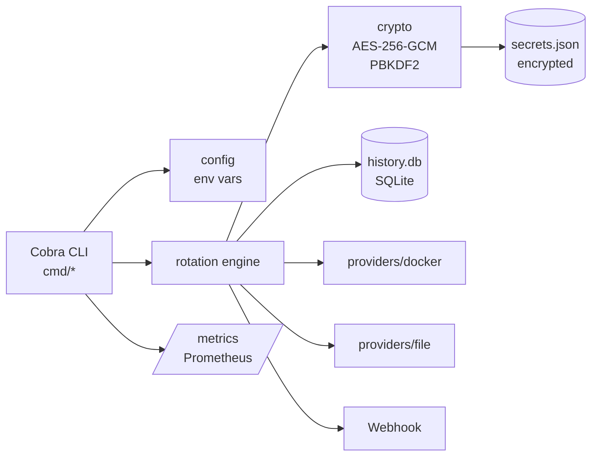

<div align="center">
  <h1>GoSecretsRotator</h1>
  <p>Encrypted secret vault and rotation engine for Docker containers and configuration files.</p>

  

  <br>


[](https://goreportcard.com/report/github.com/esousa97/gosecretsrotator)
[](https://www.codefactor.io/repository/github/esousa97/gosecretsrotator)
[](https://pkg.go.dev/github.com/esousa97/gosecretsrotator)


</div>

---

**GoSecretsRotator** is a lightweight CLI and daemon that stores secrets in an encrypted local vault (AES-256-GCM with PBKDF2) and rotates them on a schedule, propagating new values to live Docker containers and `.env`/`.yaml` files. It tracks every rotation in a SQLite history database, supports one-command rollback after an incident, exposes Prometheus metrics, and notifies external systems via webhooks.

## Table of Contents

- [Overview](#overview)
- [Features](#features)
- [Tech Stack](#tech-stack)
- [Prerequisites](#prerequisites)
- [Installation](#installation)
- [Quick Start](#quick-start)
- [Configuration](#configuration)
- [Usage Guide](#usage-guide)
- [Testing](#testing)
- [Architecture](#architecture)
- [Rotation Targets](#rotation-targets)
- [Providers](#providers)
- [Observability](#observability)
- [Security Model](#security-model)
- [Examples](#examples)
- [Roadmap](#roadmap)
- [Contributing](#contributing)

## Overview

When a rotation cycle runs, the daemon picks every secret whose interval has elapsed, generates a fresh value, applies it to all attached targets, and records the operation:

```text
$ gosecretsrotator daemon --check-interval=1h
2026/04/14 10:00:00 metrics server starting on :2112
2026/04/14 10:00:00 daemon starting; check interval=1h0m0s
2026/04/14 10:00:00 rotating "DB_PASSWORD" (interval=30d)
2026/04/14 10:00:00 rotated "DB_PASSWORD" OK
2026/04/14 10:00:00 rotating "API_TOKEN" (interval=14d)
2026/04/14 10:00:00 rotated "API_TOKEN" OK
```

If propagation fails on any target, the rotation is marked `failure` in the SQLite history and the previous value remains in the vault — ready for `incident rollback` to undo any partial change.

## Features

| Feature | Description |
|---------|-------------|
| 🔐 **Encrypted Vault** | AES-256-GCM with PBKDF2 key derivation; vault written with `0600` permissions |
| 🔄 **Automatic Rotation** | Per-secret interval (in days); daemon checks on a configurable tick |
| 🎲 **Strong Password Generation** | `crypto/rand` over a 74-char alphabet (alphanumeric + symbols) |
| 🐳 **Docker Injection** | Recreates a container with the new env var, preserving network endpoints |
| 📝 **File Injection** | Updates `.env` (preserves comments) and `.yaml` (AST-based, preserves structure) |
| 🗄️ **History & Rollback** | Every rotation logged to SQLite; `incident rollback` reverts to last good value |
| 📊 **Prometheus Metrics** | Rotation counters, expiry gauge, per-secret last-success timestamp |
| 🚨 **Webhooks** | JSON POST to Slack/Discord/custom endpoint after each successful rotation |
| 💻 **CLI + Daemon Modes** | One-shot rotation or background polling with graceful shutdown |
| 🛡️ **Compose-Aware** | Refuses to recreate compose-managed containers; points to the safe `.env` path |

## Tech Stack

| Technology | Purpose |
|---|---|
| **Go 1.25** | Single static binary, strong stdlib, good for CLI and daemon workloads |
| **Cobra** | CLI command tree (`add`, `get`, `rotate`, `daemon`, `incident`, `inject`, `target`) |
| **AES-256-GCM + PBKDF2** | Authenticated encryption of the vault file (`golang.org/x/crypto/pbkdf2`) |
| **mattn/go-sqlite3** | Embedded history database for rotation/rollback auditing |
| **moby/moby/client** | Docker SDK for container inspect/stop/recreate |
| **gopkg.in/yaml.v3** | YAML AST manipulation (preserves comments and ordering) |
| **prometheus/client_golang** | Metrics exposition on `/metrics` |
| **spf13/cobra** | Command-line framework with subcommands and required flags |

## Prerequisites

- **Go** >= 1.25.0 (only for build-from-source)
- **CGO + gcc/clang** (for the SQLite history driver — required when building or running tests with `-race`)
- **Docker** daemon running (only when using the `docker` target / `inject docker`)
- *(Optional)* Slack/Discord webhook URL for rotation notifications

## Installation

### From Source

```bash
git clone https://github.com/esousa97/gosecretsrotator.git
cd gosecretsrotator

# CGO is required for the SQLite history driver
CGO_ENABLED=1 go build -o gosecretsrotator .

./gosecretsrotator --help
```

### Via `go install`

```bash
CGO_ENABLED=1 go install github.com/esousa97/gosecretsrotator@latest
gosecretsrotator --help
```

### Master Password

Every command needs a master password to unseal the vault. Export it once per shell:

```bash
export GOSECRETS_MASTER_PWD='choose-a-strong-passphrase'
```

> The vault file (`secrets.json`) is encrypted with this password. Lose it and the vault is unrecoverable — there is no recovery key.

## Quick Start

### 1. Add a Secret to the Vault

```bash
export GOSECRETS_MASTER_PWD='my-strong-master'

gosecretsrotator add DB_PASSWORD 'initial-value'
gosecretsrotator add API_TOKEN  'initial-token'
```

### 2. Configure a Rotation Policy

```bash
# Rotate DB_PASSWORD every 30 days, API_TOKEN every 14
gosecretsrotator rotation set DB_PASSWORD --days 30
gosecretsrotator rotation set API_TOKEN  --days 14
```

### 3. Attach Rotation Targets

```bash
# Push DB_PASSWORD into a running Docker container's env
gosecretsrotator target add docker \
  --secret DB_PASSWORD \
  --container my-postgres \
  --env-key  POSTGRES_PASSWORD

# Push API_TOKEN into a .env file
gosecretsrotator target add file \
  --secret API_TOKEN \
  --path   ./app/.env \
  --field  API_TOKEN
```

### 4. Rotate Now (Manual) or Start the Daemon

```bash
# Manual rotation — applies to all attached targets
gosecretsrotator rotate DB_PASSWORD

# Or run the daemon (rotates expired secrets on each tick, exposes /metrics)
gosecretsrotator daemon --check-interval=1h
```

## Configuration

### Environment Variables

| Variable | Type | Default | Description |
|---|---|---|---|
| `GOSECRETS_MASTER_PWD` | String | — *(required)* | Passphrase used to derive the AES-256 key (PBKDF2-SHA256) |
| `GOSECRETS_WEBHOOK_URL` | String | `""` | If set, every successful rotation POSTs a JSON payload here |
| `GOSECRETS_METRICS_PORT` | Int | `2112` | Port for the Prometheus `/metrics` endpoint (daemon mode only) |

### Command-Line Flags

```text
gosecretsrotator [command]

Available Commands:
  add         Add or update a secret
  get         Get a secret's value
  rotate      Manually rotate a secret now
  rotation    Configure rotation policy for a secret
  target      Manage rotation targets attached to a secret
  inject      Inject secrets into different providers (docker, file)
  daemon      Run the rotation engine in the foreground
  incident    Handle security incidents and rollbacks
  help        Help about any command

Flags:
  -h, --help   help for gosecretsrotator
```

Per-command flags:

| Command | Flag | Default | Purpose |
|---|---|---|---|
| `daemon` | `--check-interval` | `1h` | How often the daemon scans for expired secrets |
| `rotation set` | `--days, -d` | `30` | Rotation interval; `0` disables auto rotation |
| `target add docker` | `--secret/-s, --container/-c, --env-key/-k` | — | Vault key, target container, env var name |
| `target add file` | `--secret/-s, --path/-p, --field/-f` | — | Vault key, target file, key inside the file |
| `inject docker` | `--container/-c, --key/-k, --secret/-s` | — | One-off injection without storing a target |
| `inject file` | `--path/-p, --key/-k, --secret/-s` | — | One-off injection into `.env` or `.yaml` |
| `incident rollback` | `--secret-name` | — | Reverts the secret to the previous successful value |

## Usage Guide

### 1. One-Shot Rotation

Rotate a secret immediately and propagate to all attached targets:

```bash
gosecretsrotator rotate DB_PASSWORD
# Rotated 'DB_PASSWORD' successfully
```

The new value is generated with `crypto/rand` (32 chars) from the alphabet `A–Z a–z 0–9 !@#$%^&*-_=+`.

### 2. Daemon Mode

Run continuously and rotate any secret whose interval has elapsed:

```bash
export GOSECRETS_MASTER_PWD='...'
export GOSECRETS_WEBHOOK_URL='https://hooks.slack.com/services/...'
export GOSECRETS_METRICS_PORT=2112

gosecretsrotator daemon --check-interval=15m
```

Output:

```text
2026/04/14 10:00:00 metrics server starting on :2112
2026/04/14 10:00:00 daemon starting; check interval=15m0s
2026/04/14 10:15:00 rotating "API_TOKEN" (interval=14d)
2026/04/14 10:15:01 rotated "API_TOKEN" OK
```

The daemon exits cleanly on `SIGINT`/`SIGTERM`.

### 3. Incident Rollback

If a rotation propagated correctly to the vault but a downstream service is broken (revoked old credential, race condition, etc.), revert in one shot:

```bash
gosecretsrotator incident rollback --secret-name DB_PASSWORD
# Successfully rolled back secret 'DB_PASSWORD' to previous version
```

The rollback:
1. Reads the previous successful value from `history.db`.
2. Re-applies it to every target.
3. Writes the rollback as a new history entry (operation = `rollback`).

### 4. One-Off Injection

Push a vault value into a target without registering it for auto-rotation — useful for bootstrapping:

```bash
# Into a Docker container
gosecretsrotator inject docker -c my-app -k DB_URL -s DB_PASSWORD

# Into a .env file
gosecretsrotator inject file -p ./.env -k DB_PASSWORD -s DB_PASSWORD

# Into a YAML file
gosecretsrotator inject file -p ./config.yaml -k password -s DB_PASSWORD
```

### 5. Reading a Secret

```bash
gosecretsrotator get API_TOKEN
# Secret for 'API_TOKEN': aB3$kZ9...
```

## Testing

### Unit Tests

```bash
# All packages (no race detector — works without CGO)
go test ./...

# With coverage
go test -cover ./...

# Verbose
go test -v ./...
```

### Race Detector (CI parity)

The CI runs `go test -race`, which requires CGO + a C toolchain:

```bash
CGO_ENABLED=1 go test -race -count=1 ./...
```

### Linting (CI parity)

```bash
go install github.com/golangci/golangci-lint/v2/cmd/golangci-lint@v2.11.4
golangci-lint run --verbose
```

### End-to-End Test (full CLI flow)

The repo includes an integration test that drives the binary through `add` → `inject file` for `.env` and `.yaml` (see [tests/integration_test.go](tests/integration_test.go)):

```bash
go test ./tests/...
```

## Architecture

GoSecretsRotator is layered to keep the cryptographic, storage, and provider concerns isolated:



### Package Structure

```text
gosecretsrotator/
├── main.go                            # Entry point — delegates to cmd.Execute()
├── cmd/                               # Cobra command tree
│   ├── root.go                        # Root command wiring
│   ├── add.go / get.go                # Vault read/write
│   ├── rotation.go                    # rotate + rotation set
│   ├── target.go                      # target add docker | file
│   ├── inject.go                      # inject parent
│   ├── inject_docker.go               # inject docker (one-off)
│   ├── inject_file.go                 # inject file  (one-off)
│   ├── daemon.go                      # daemon runner + metrics server
│   └── incident.go                    # incident rollback
├── internal/
│   ├── config/                        # Env var parsing (master pwd, webhook, port)
│   ├── crypto/                        # AES-GCM seal/open + password generator
│   ├── storage/                       # Encrypted vault + SQLite history
│   ├── rotation/                      # Rotation engine, metrics, webhook client
│   └── providers/
│       ├── docker/                    # Docker container env-var update
│       └── file/                      # .env and .yaml injectors
└── tests/                             # End-to-end CLI tests
```

### Design Patterns

- **Strategy / Adapter** — `ApplyTarget` dispatches on `target.Type` (`docker` / `file`) so new providers slot in by adding a case.
- **Repository** — `storage.Store` and `storage.HistoryDB` hide the encrypted JSON and SQLite details from callers.
- **Producer/Consumer** — the daemon ticker produces rotation events, `RotateSecret` consumes them.
- **Backwards-compatible deserialization** — `Store.Load` falls back to a legacy `map[string]string` shape if the modern `Secret` struct fails to unmarshal.

A deeper walkthrough lives in [docs/ARCHITECTURE.md](docs/ARCHITECTURE.md).

## Rotation Targets

Each secret can carry zero-or-more `Target` entries. When the engine rotates a secret, it walks the targets in order; if any one fails, the rotation is aborted and recorded as `failure` in history.

| Target Type | Required fields | Behavior |
|---|---|---|
| **`docker`** | `container`, `env_key` | Inspects the container, rebuilds it with the updated env var, preserves network endpoints, force-removes the old one |
| **`file`** | `path`, `file_key` | `.env` → line-level rewrite preserving comments; `.yaml`/`.yml` → AST update preserving structure |

Compose-managed containers are intentionally rejected by the Docker target — recreating one orphans it from its Compose project. Inject into the project's `.env` and run `docker compose up -d` instead.

## Providers

### Docker Provider

- **API**: `github.com/moby/moby/client` (initialized via `client.FromEnv`)
- **Operation**: inspect → stop → rename old → create new (with same Config + HostConfig + Networks) → start → remove old
- **Safety**: refuses to touch containers with `com.docker.compose.project` label

```bash
gosecretsrotator target add docker \
  --secret DB_PASSWORD \
  --container my-postgres \
  --env-key POSTGRES_PASSWORD
```

### File Provider

- **`.env`**: line-by-line scanner; the `#`-comment splitter respects single and double quotes so `KEY="val#ue"` is left untouched.
- **`.yaml` / `.yml`**: parsed into a `yaml.Node` AST; key lookup recurses into nested mappings, preserving original layout and comments.
- Files are rewritten with `0600` permissions.

```bash
gosecretsrotator target add file \
  --secret API_TOKEN \
  --path   ./app/.env \
  --field  API_TOKEN
```

## Observability

### Prometheus Metrics

The daemon serves `/metrics` on the port set by `GOSECRETS_METRICS_PORT` (default `2112`):

```bash
curl http://localhost:2112/metrics | grep gosecrets_
```

| Metric | Type | Labels | Description |
|---|---|---|---|
| `gosecrets_rotations_total` | Counter | `status=success\|failure` | Cumulative count of rotation attempts |
| `gosecrets_secrets_expiring_soon` | Gauge | — | Secrets due to rotate within the next 3 days |
| `gosecrets_last_rotation_success` | Gauge | `secret_name` | Unix timestamp of the last successful rotation |

### Grafana Dashboard

Useful PromQL starting points:

```promql
# Rotation success rate over 1h
rate(gosecrets_rotations_total{status="success"}[1h])
  /
rate(gosecrets_rotations_total[1h])

# How many secrets are about to expire
gosecrets_secrets_expiring_soon

# Time since last successful rotation per secret
time() - gosecrets_last_rotation_success
```

### Webhook Payload

When `GOSECRETS_WEBHOOK_URL` is set, a successful rotation POSTs:

```json
{
  "secret_name": "DB_PASSWORD",
  "timestamp":   "2026-04-14T10:00:01Z",
  "message":     "Rotation successful"
}
```

The HTTP status is checked: `>= 300` is logged as a webhook failure but does **not** revert the rotation.

### Logs

All output goes to stdout/stderr via the stdlib `log` package — easy to capture from systemd, Docker, or any orchestrator.

## Security Model

- **At rest**: vault encrypted with AES-256-GCM; key derived via PBKDF2-SHA256 (10 000 iterations) from `GOSECRETS_MASTER_PWD`. File permissions are `0600`.
- **In memory**: secrets are kept in plaintext only while a command is running. There is no on-disk plaintext at any point.
- **History**: `history.db` stores rotated values to enable rollback. Treat it with the same care as the vault — see [SECURITY.md](SECURITY.md) for hardening notes.
- **Threat model & limitations**: see [SECURITY.md](SECURITY.md) (no HSM/KMS integration, fixed salt, single-process locking, etc.). Use this as a learning project, not as a drop-in production secret manager.

## Examples

### Example 1: Postgres + App via Docker

```bash
export GOSECRETS_MASTER_PWD='strong-master'

# 1. Seed the vault
gosecretsrotator add POSTGRES_PASSWORD 'bootstrap-pwd'

# 2. Set policy
gosecretsrotator rotation set POSTGRES_PASSWORD --days 30

# 3. Attach two targets — DB and the app that reads it
gosecretsrotator target add docker -s POSTGRES_PASSWORD -c pg-prod  -k POSTGRES_PASSWORD
gosecretsrotator target add docker -s POSTGRES_PASSWORD -c app-prod -k DB_PASSWORD

# 4. Run the daemon
gosecretsrotator daemon --check-interval=1h
```

When the policy fires, both containers are recreated with the same new password — no drift.

### Example 2: GitOps-style with `.env`

```bash
# Repository layout
# .
# ├── docker-compose.yaml   # references ${API_TOKEN}
# └── .env                  # API_TOKEN=...

gosecretsrotator add API_TOKEN 'seed-value'
gosecretsrotator rotation set API_TOKEN --days 14
gosecretsrotator target add file -s API_TOKEN -p ./.env -f API_TOKEN

# Combine with a CI step that runs `docker compose up -d` after rotation
gosecretsrotator daemon --check-interval=6h
```

### Example 3: CI/CD Audit (read-only)

```bash
# In a pipeline — verify a secret is not stale
LAST=$(curl -s http://daemon:2112/metrics \
       | awk '/gosecrets_last_rotation_success.*API_TOKEN/ {print $2}')
NOW=$(date +%s)
if (( NOW - ${LAST%.*} > 1209600 )); then
  echo "API_TOKEN has not been rotated in 14 days"
  exit 1
fi
```

### Example 4: Incident Response

```bash
# Suspected leak — force a rotation immediately
gosecretsrotator rotate API_TOKEN

# New token broke a downstream service — revert
gosecretsrotator incident rollback --secret-name API_TOKEN

# Once the downstream is fixed, rotate again
gosecretsrotator rotate API_TOKEN
```

## Roadmap

The project was built in five stages — all delivered.

### Stage 1 — The Vault (Encryption & Storage)

- [x] AES-256-GCM authenticated encryption for the local vault
- [x] PBKDF2-SHA256 key derivation from `GOSECRETS_MASTER_PWD`
- [x] Cobra CLI scaffolding with `add` and `get` commands
- [x] Encrypted JSON vault with `0600` file permissions

### Stage 2 — Environment Injection (Docker & Files)

- [x] Docker provider: locate container by name, update env var by recreating it, preserve network endpoints
- [x] `.env` file provider with comment- and quote-aware rewriting
- [x] `.yaml`/`.yml` file provider using AST traversal to preserve structure and comments
- [x] One-off `inject docker` and `inject file` subcommands

### Stage 3 — The Rotation Cycle (Automation)

- [x] Cryptographically secure password generator (`crypto/rand`, 74-char alphabet)
- [x] Per-secret rotation interval policy (`rotation set --days`)
- [x] `daemon` command with configurable check interval and graceful shutdown
- [x] Persistent `Target` configuration applied automatically on rotation

### Stage 4 — Audit & Versioning (Audit Log & Rollback)

- [x] SQLite-backed history database recording every rotation attempt
- [x] Status tracking (`success` / `failure`) with error messages for auditing
- [x] `incident rollback --secret-name` command that restores the previous successful value
- [x] Append-only history schema (no in-place mutation)

### Stage 5 — External Integration (Webhooks & Metrics)

- [x] JSON webhook POST after every successful rotation (Slack/Discord/Coolify-compatible)
- [x] Prometheus `/metrics` endpoint exposed by the daemon
- [x] `gosecrets_rotations_total{status}` counter for success/failure tracking
- [x] `gosecrets_secrets_expiring_soon` gauge for upcoming expirations
- [x] `gosecrets_last_rotation_success{secret_name}` gauge for per-secret freshness

## Contributing

See [CONTRIBUTING.md](./CONTRIBUTING.md) for instructions on running tests, linting, and opening pull requests.

## License

[MIT License](./LICENSE)

<div align="center">

## Author

**Enoque Sousa**

[](https://www.linkedin.com/in/enoque-sousa-bb89aa168/)
[](https://github.com/esousa97)
[](https://enoquesousa.vercel.app)

**[⬆ Back to Top](#gosecretsrotator)**

Made with ❤️ by [Enoque Sousa](https://github.com/esousa97)

**Project Status:** Study project — feature-complete for Docker + file targets

</div>
